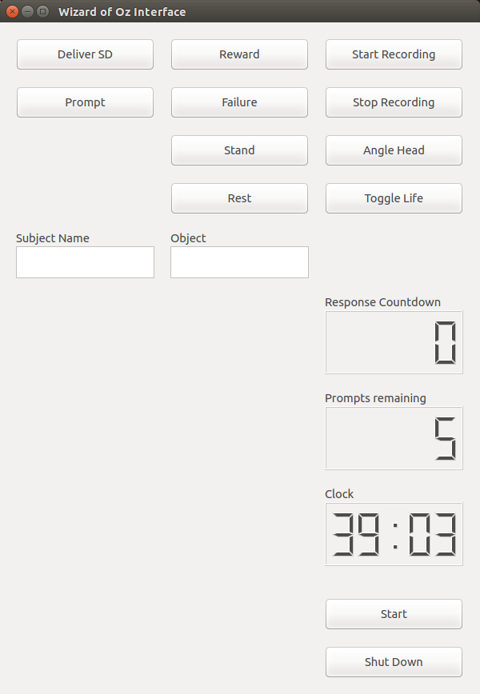

# Temporal Context Graph (TCG)
Author: Estuardo Carpio

This repository contains the following components:
1. TCG: Implementation of the Temporal Context Graph, a temporal reasoning model designed to learn the structure of human-robot interactions from demonstrations (LfD). Learned interactions can then be replicated autonomously by a robotic agent. Includes the implementation of Convolutional Neural Networks (CNN) as perception modules for the following use cases:

    * Social Greeting Interaction: Applied Behavioral Analysis (ABA) styled behavioral intervention (BI) designed to teach a social skill to the participant.

    * Object Naming Interaction: ABA styled BI designed to teach a participant the name of an object through a series of repetitive prompts.
    
2. WoZ: Wizard of Oz graphical user interface (GUI) used for the data collection process. This GUI is also needed during the autonomous execution of the interactions, as this software includes a ROS node that sends action commands to the NAO robot that deliver the BI.
3. Nao Interface: ROS node used as an interface between the TCG model and the WoZ GUI. 


Learning a TCG
--------------------

Temporal Context Graphs can be learned from input files containing the name, start and end times of the interaction that wants to be learned. Sample input files are included in the *model/TCG/input/* directory.

To learn a TCG a simple python script with the following function calls needs to be created:

```
# indicate the directory containing the input file
input_dir = <input directory>

# instantiate the TCG and indicate the transition events
tcg = TemporalContextGraph(transition_events=[<list of transition events>])

# learn the model
tcg.learn_model_from_files(input_dir)

# (optional) output a png representation of the model
tcg.output_graph(<output directory>)
```

After a TCG model has been learned it can be used for temporal-based policy selection by using the following function calls: 

```
# called at the start of the task execution
tcg.initialize_policy_selector(state, 'abort')


# the following functions need to be called at every time-step
# passes an observation to the TCG model 
tcg.process_observation(<observation>, <current time>)

# executes policy selection if needed
new_state = tcg.evaluate_timeout(<current time>)

```

Usage for LfD Use Cases
=============

The system collects demonstrations of the BI using a tele-operated NAO robot. Then, the CNN models extract relevant spatial features of the interaction. Simultaneously, the tele-operation records are employed to learn the temporal structure of the interaction using a TCG. During execution the CNN models provide real-time observations that are processed by the TCG in order to perform policy selection and deliver the intervention autonomously. For the purposes of privacy we have excluded the raw demonstration data but include the tools to generate additional demonstration files.


Usage of the system occurs in three steps:
1. Collection of training data using a tele-operated robot as it delivers the desired BI
2. Learning of the BI
⋅⋅⋅A. Spatial features are extracted by the CNN models
⋅⋅⋅B. Temporal features are learned by a TCG model
3. Execution of the learned BI using an autonomous system


Use cases
--------------------

### Social Greeting BI:
1. The therapist/robot delivers a *Discriminative Stimuli* (The robot says "hello <participant>" and waves)
2. The participant provides a *response* that is either compliant (responding to the robot) or non-compliant (refusing to acknowledge the robot's command)
3. The robot reacts to the participants response:
   - Compliant: the robot delivers a *reward* congratulating the participant. The BI then continues to step 4
   - Non-compliant: the robot delivers a *prompt* instructing the participant to respond in a compliant manner (saying "<Participant>, say hello" and waving). The BI then returns to step 2 or if a prompt had already been provided and a compliant response has not been provided the BI proceeds to step 4.
4. The robot ends the BI by saying "Good Bye <participant>"


### Object Naming BI:
1. The therapist/robot delivers a *Discriminative Stimuli* (The robot says "Hello <participant> what is this?" while pointing to the object)
2. The participant provides a *response* that is either correct (providing the correct name of the object) or incorrect (staying silent or providing an incorrect name)
3. The robot reacts to the participants response:
   - Correct: the robot delivers a *reward* congratulating the participant. Then continues to step 4
   - Incorrect: the robot delivers a *prompt* instructing the participant to respond in a compliant manner (saying "<Participant>, say hello" and waving). The BI hen returns to step 2. Steps 2 and 3 are repeated up to 4 times if the participant fails to elicit a correct response, otherwise the BI proceeds tho step 4.
4. The robot ends the BI by saying "Good Bye"
 

Data Collection
--------------------

Data collection is performed using a tele-operated NAO humanoid robot. Demonstrations are recorded as rosbags and then converted into TFRecords for training in the CNNs.

The robot can be operated using the provided WoZ interface. The interface can be opened using the following commands in separate terminals

```
roslaunch nao_bringup nao_full_py.launch
roslaunch woz_interface woz_interface.launch
```


  
The following buttons perform the following operations:

Autonomous BI delivery:
- **Start:** Starts the intervention. This can also be triggered by pushing the right bumper of the robot.
- **Shut Down:** Ends the interaction and shuts down the system.

Action Functions:
- **Deliver SD:** delivers the *Discriminative Stimuli* (SD)
- **Prompt:** executes the *Prompt* action
- **Reward:** executes the *Reward* action
- **Failure:** executes the *Abort* action

Recording Functions:
- **Start Record:** starts recording observations of the BI in a rosbag
- **Stop Record:** stops recording observations of the BI and outputs the generated rosbag to the "~/bag" directory

Stance Functions:
- **Stand:** places the robot in a standing stance
- **Rest:** places the robot in a resting stance
- **Angle Head:** angles the robot's head down so that the camera is focused on the participant
- **Toggle Life:** disables autonomous life on the NAO robot

When delivering the SD, prompt, and reward actions the robot will use the participants name if listed in the *Subject Name* textbox. Similarly, the object to be named has to be included in the *Object* textbox, this information is used during the SD and prompt actions. 

A live feed of what the robot observes is displayed in the interface and a clock displaying the current time (minutes and seconds) is provided for operations that require timing on the part of the system operator. Additionally a response countdown is started as an additional reference to the system operator. The prompts remaining counter is updated as the interaction progresses.

To record training examples begin by selecting 'Start Record', then perform the desired function (e.g. the SD action followed by an observation period of several seconds (indicated by the response countdown), the REW action, and then the END action). Once the entire interaction has been observed select the 'Stop Record' button to generate a rosbag file (extension .bag) in the "~/bag" directory described in the installation instructions.

Once a collection of rosbag demonstrations have been recorded the files can be converted to TFRecords using

```
# file is contained in the model/perception/ directory
python generate_tfrecord_from_rosbag.py
```

Training the CNNs
--------------------

The CNN models must be trained separately, this can be achieved by running the following command

```
# file is contained in the model/perception/<CNN model> directory
python <model name>_trainer.py
```

The trainer will begin optimizing the network and will output a partially trained model every 10,000 iterations. The finalized network values will be output in the directory suffixed by "_final". 

Once the trained network can be evaluated by executing

```
# file is contained in the model/perception/<CNN model> directory
python <model name>_validator.py
```

Execution of Autonomous System
--------------------


The automated BI can be executed by opening the WoZ interface and the appropriate action selector from the *nao_interface*. The the autonomous BI is delivered by clicking the *Start* button or pressing the right bumper on the robot.

```
# file is contained in the model/nao_interface directory
python <use case name>_action_selector.py

roslaunch nao_bringup nao_full_py.launch
roslaunch woz_interface woz_interface.launch
```

Dependencies
=============
The following libraries are used by this application:
- [Tensorflow](https://www.tensorflow.org/) - Deep network library
- [NumPy](http://www.numpy.org/) - Python numerical libraries
- [OpenCV2](https://opencv.org/) - Open Source image processing library
- [Librosa](https://librosa.github.io/librosa/index.html) - Music and audio analysis library
- [ROS Indigo](http://wiki.ros.org/) - Robot Operating System
- [ROS naoqi](https://github.com/ros-naoqi/nao_robot.git) - ROS interface for NAO
- [Qt](https://www.qt.io/) - GUI